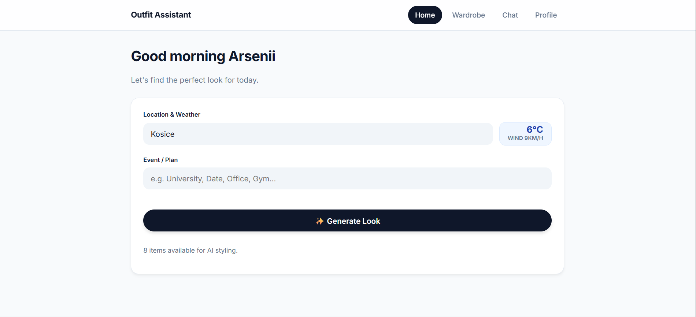
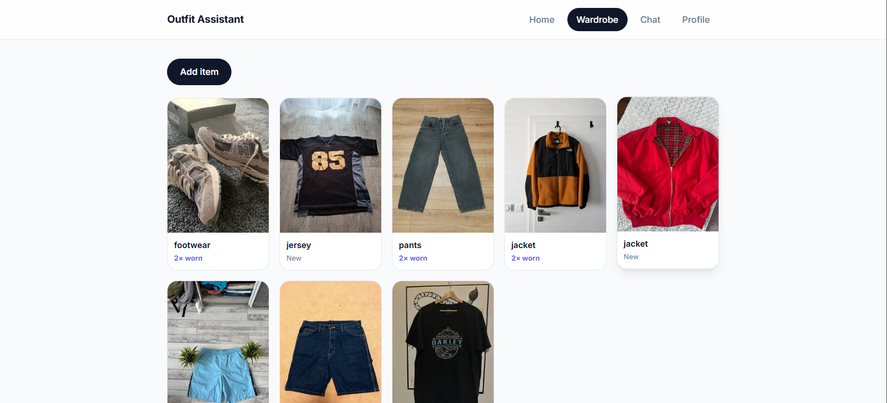
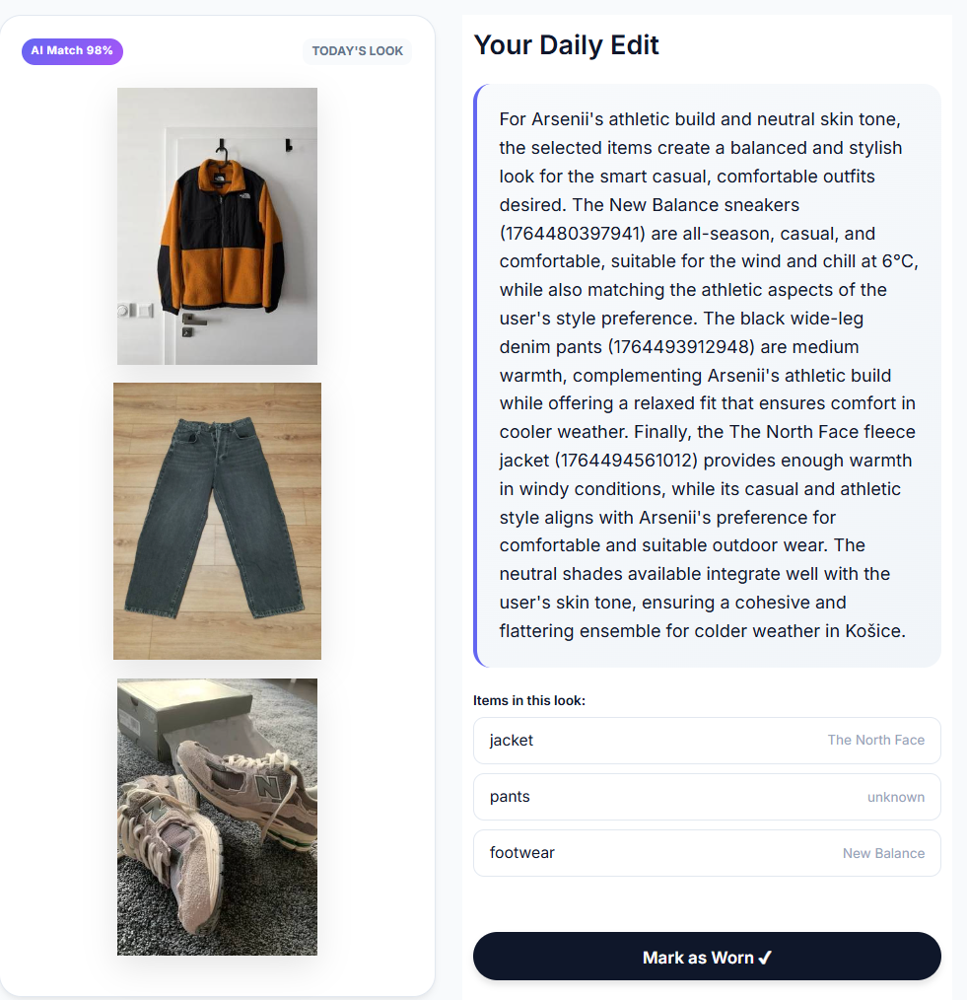
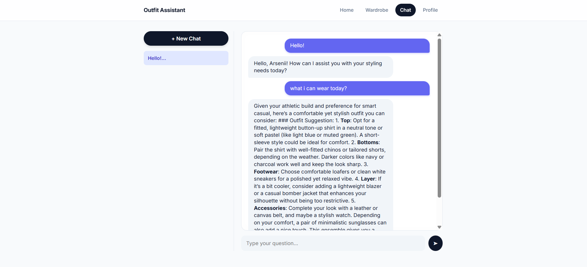

<div align="center">
    
    <h1>✨ AI Outfit Assistant</h1>
    <h1>Yeah-yeah-yeah, Coco Jamboo, yeah-yeah-yeah</h1>
    <p><strong>Team Coco_Jamboo-01</strong> | <em>Hackathon 2025 - megabrAIns</em></p>
      <p>
        <a href="#-about-the-project">About</a> •
        <a href="#-key-features">Features</a> •
        <a href="#-tech-stack">Tech Stack</a> •
        <a href="#-installation">Installation</a> •
        <a href="#-team">Team</a>
      </p>


</div>

---

## 💡 About The Project

**"Make your day easier, smarter, and more efficient."**

We all face the *"What should I wear?"* paralysis every morning. It wastes time and adds unnecessary stress.

**Outfit Assistant** is an AI-powered personal stylist that understands your wardrobe, your local weather, and your
daily plans. Unlike basic styling apps, it focuses on **Sustainability ("Slow Fashion")** by encouraging you to wear
items you already own but often forget about.

It's not just a database; it's an intelligent agent that:

1. **Sees:** Recognizes your clothes from photos automatically.
2. **Thinks:** Matches weather, event context, and color theory.
3. **Visualizes:** Shows you exactly how the outfit looks on a virtual mannequin.

## 📸 Screenshots

|                    **Smart Dashboard**                    |                      **AI Wardrobe**                       |
|:---------------------------------------------------------:|:----------------------------------------------------------:|
|  |  |
|          *Real-time weather & Outfit generation*          |              *Auto-tagging & categorization*               |

|                 **Virtual Mannequin**                  |                  **Context Chat**                  |
|:------------------------------------------------------:|:--------------------------------------------------:|
|  |  |
|              *Visual stack of your look*               |         *Ask for specific fashion advice*          |

---

## 🚀 Key Features

### 🌤️ Context-Aware Styling

* **Real-Time Weather:** Automatically fetches detailed forecasts (temp, wind, conditions) for your city via Open-Meteo
  API.
* **Event Understanding:** Going to the *Gym*, *Office*, or a *Date*? The AI adapts the formality and functionality of
  the outfit.

### 👗 Smart Wardrobe Management

* **AI Auto-Tagging:** Upload a photo, and GPT-4o Vision instantly detects the item type, color, season, and style. No
  manual typing required.
* **Image Compression:** Client-side optimization ensures fast uploads even with high-res phone camera photos.

### 🌱 Sustainability & Slow Fashion

* **Usage Tracking:** The app tracks how often you wear each item.
* **Smart Rotation:** The algorithm prioritizes items you haven't worn in a while to maximize your wardrobe utility and
  reduce fashion waste.

### 💬 Personal AI Stylist Chat

* **Contextual Memory:** The chat knows your name, city, body type, and style preferences.
* **History:** Continues conversations seamlessly, remembering what you discussed 5 minutes ago.

### 👤 Detailed Profiling

* **Body & Style DNA:** Custom inputs for measurements, body type, and skin tone ensure the AI suggests flattering fits
  and colors.

---

## 🛠️ Tech Stack

* **Backend:** Python, Flask
* **Frontend:** HTML5, CSS3 (Modern Glassmorphism), Vanilla JS
* **AI Engine:** OpenAI API (GPT-4o for reasoning, GPT-4o-mini for chat & vision)
* **Data:** LocalStorage (Privacy-first, no external database required for demo), JSON
* **External APIs:** Open-Meteo (Weather), OpenAI

---

## 💻 Installation

Follow these steps to set up the project locally.

### Prerequisites

* Python 3.8 or higher
* An OpenAI API Key

### Steps

1. **Clone the repository**
   ```bash
   git clone [https://github.com/AlleksRoy/coco-jamboo-hackaton-2025.git](https://github.com/AlleksRoy/coco-jamboo-hackaton-2025.git)
   cd coco-jamboo-hackaton-2025
   ```

2. **Create a virtual environment**
   ```bash
   # Windows
   python -m venv venv
   venv\Scripts\activate

   # Mac/Linux
   python3 -m venv venv
   source venv/bin/activate
   ```

3. **Install dependencies**
   ```bash
   pip install -r requirements.txt
   ```

4. **Set up Environment Variables**
   Create a `.env` file in the root directory and add your key:
   ```env
   OPENAI_API_KEY=sk-your-api-key-here
   ```

5. **Run the application**
   ```bash
   python app.py
   ```

6. **Open in browser**
   Go to `http://127.0.0.1:5000`

---

## 👥 Team

**Coco_Jamboo** — *Put me up, take my heart, and make me happy*

* **Arsenii Burlaka**
* **Nikita Baranenko**
* **Arsenii Opryshko**
* **Yurii Chechur**
* **Orest Sheremeta**

---

<div align="center">
  <p>Made with ❤️ and ☕ in Košice</p>
</div>